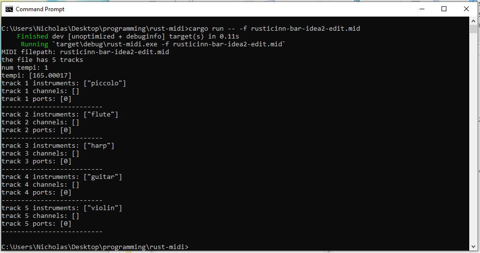

just playing with Rust to explore MIDI files. nothing much to see here atm :)    
    
also thanks to the creators of [nodi](https://github.com/insomnimus/nodi), [midly](https://github.com/kovaxis/midly) and [midir](https://github.com/Boddlnagg/midir), which help make it fairly easy to work with MIDI files.    
    
    
    
[temp_06-04-2024_162801_edit.mp4](https://github.com/syncopika/rust-midi/assets/8601582/b489dad8-a3f5-4e52-ad68-3b0304fa1cae)

